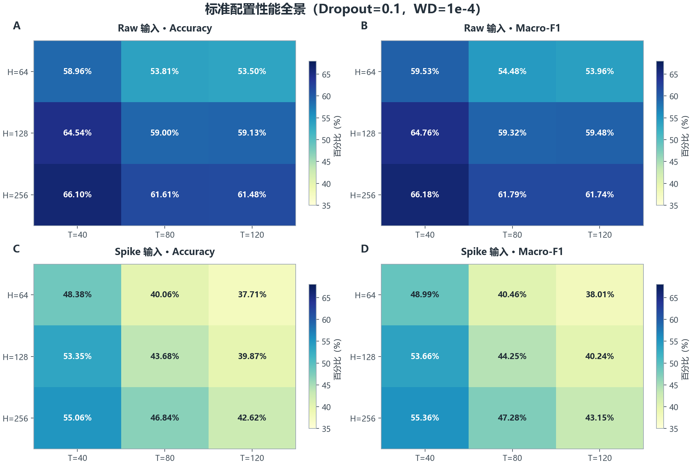
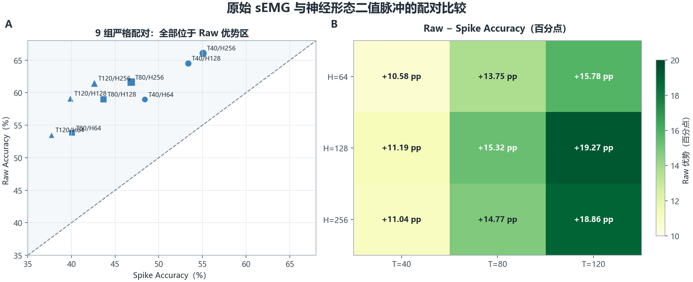
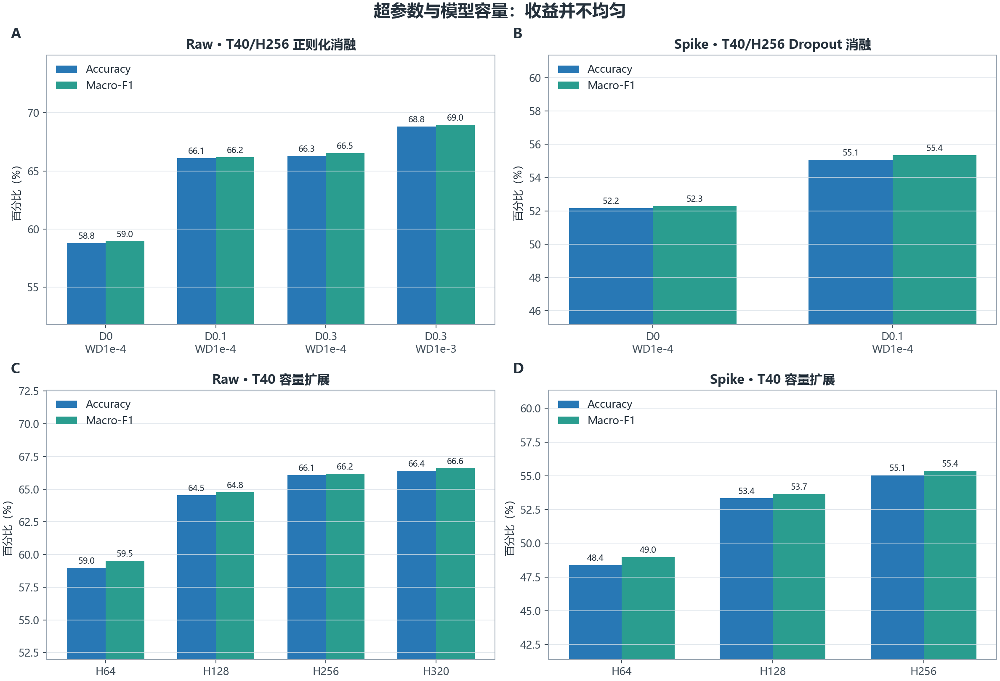
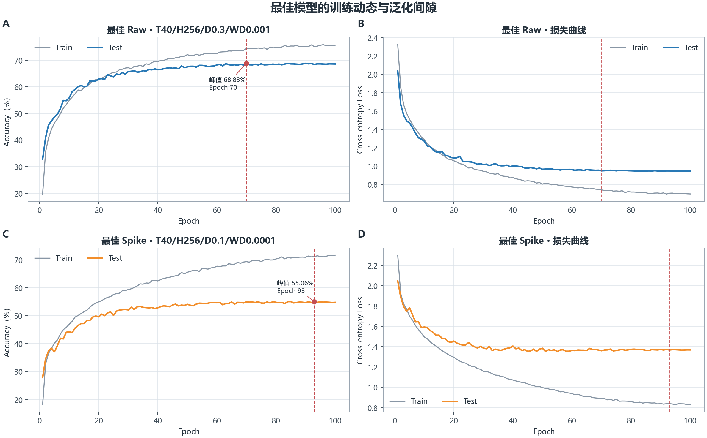
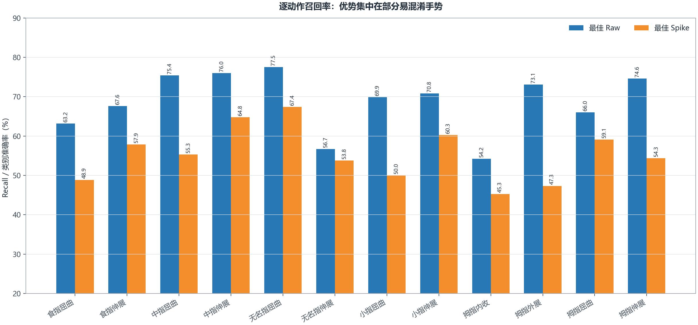
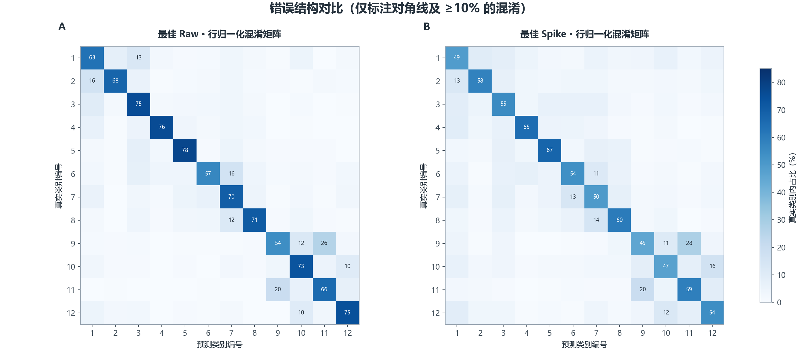

# NinaPro SNN 训练结果详细对比报告

> 分析日期：2026-08-26  
> 数据范围：`outputs/` 下全部 23 组完整实验（23 份 `metrics.json`、23 份 `history.json`）  
> 任务：NinaPro DB5 Exercise A，12 类手指动作，窗口级分类

## 1. 执行摘要

当前实验的最明确结论是：**在现有神经形态编码、模型结构和训练策略下，原始 sEMG（raw）显著优于二值脉冲（spike）输入**。标准配置网格中的 9 组严格配对实验全部由 raw 获胜，Accuracy 优势为 **10.58～19.27 个百分点**，平均为 **14.51 个百分点**。

| 结论项 | 结果 | 含义 |
|:---|:---|:---|
| 全局最佳 | Raw，`T40/H256/Dropout0.3/WD1e-3` | Accuracy **68.83%**，Macro-F1 **68.98%** |
| Spike 最佳 | Spike，`T40/H256/Dropout0.1/WD1e-4` | Accuracy **55.06%**，Macro-F1 **55.36%** |
| 两类输入各自最佳的差距 | Raw 高 **13.77 pp** | 两者均为 T40/H256，但正则化不同 |
| 严格同配置 T40/H256 对比 | Raw 66.10% vs Spike 55.06% | Raw 高 **11.04 pp** |
| 标准网格平均 | Raw 59.79% vs Spike 45.29% | Raw 平均高 **14.51 pp** |
| 最有效的消融变化 | Raw：`D0.3/WD1e-4 → D0.3/WD1e-3` | Accuracy 增加 **2.53 pp**，泛化差由 24.45 pp 降至 5.56 pp |
| 容量扩展收益 | Raw T40：H256 → H320 仅增加 **0.30 pp** | 参数量增加 **52.96%**，性价比较低 |
| 时间步结果 | 两类输入均以 T40 最好 | 单纯增加 T 没有带来精度收益，Spike 退化尤其明显 |

> **重要口径提醒：**23 组实验全部使用测试集 Accuracy 选择 `best.pt`，`metrics.json` 也是在该检查点上重新评估测试集所得。因此本文数值是**测试集选优后的描述性结果**，存在乐观偏差，不能当作严格无偏的最终泛化性能。

## 2. 实验范围与可比性

### 2.1 共同设置

- 数据集：NinaPro DB5 Exercise A，共 12 类，不含静息；
- 数据划分：重复 1、3、4、6 用于训练，重复 2、5 用于测试；
- 每组测试样本：8,787 个滑动窗口；
- 网络：两层全连接 PLIF 隐藏层，加时间一致 Dropout 和连续读出层；
- 训练：100 epoch，初始学习率 0.01，线性 warm-up 加余弦退火，随机种子 42；
- 神经元初始时间常数：`tau=2.0`；
- 指标：Accuracy、Macro-Precision、Macro-Recall、Macro-F1、交叉熵损失和逐类混淆矩阵。

Raw 输入采用逐通道 z-score 标准化。T40 使用原始 40 点、200 ms 窗口；T80 和 T120 分别将每个原始采样点零阶保持重复 2 次和 3 次，因此只细化离散时间轴，**没有增加新测量信息**。Spike 输入是同一 200 ms 窗口在 T 个时间箱上的二值脉冲序列，不做连续值归一化。

### 2.2 哪些比较最可信

| 比较 | 可比性 | 原因 |
|:---|:---:|:---|
| 同 T、同 H、同 Dropout、同 WD 的 Raw vs Spike | 高 | 共有 9 组完整配对，批大小也一致 |
| 同 T、同输入下的 H64/H128/H256 | 较高 | 只改变隐藏层宽度 |
| Raw T40/H256 的正则化消融 | 较高 | 模型容量和输入保持一致 |
| T40 vs T80/T120 | 中低 | T40 使用 batch 128，T80/T120 使用 batch 512；输入时间语义也不同 |
| 最佳 Raw vs 最佳 Spike | 中 | 适合回答“现有结果谁最好”，但两者正则化配置不同 |
| 训练时长横向比较 | 低 | T40 与 T80/T120 使用了不同批大小和执行优化路径 |

## 3. 标准配置全景

标准配置定义为：`Dropout=0.1`、`WD=1e-4`，并完整覆盖两类输入、T40/T80/T120、H64/H128/H256，共 18 组实验。



### 3.1 按时间步汇总

下表是在每个 T 内对 H64/H128/H256 做简单算术平均，不代表重复试验均值。

| T | Raw 平均 Accuracy | Spike 平均 Accuracy | Raw − Spike | 观察 |
|---:|---:|---:|---:|:---|
| 40 | 63.20% | 52.26% | **+10.94 pp** | 两类输入的最佳时间分辨率 |
| 80 | 58.14% | 43.53% | **+14.61 pp** | Raw 下降，Spike 下降更多 |
| 120 | 58.04% | 40.07% | **+17.97 pp** | Spike 进一步退化，差距最大 |
| 全部 9 组 | 59.79% | 45.29% | **+14.51 pp** | 9/9 配对均为 Raw 更高 |

Macro-F1 的标准网格均值分别为 Raw **60.14%**、Spike **45.71%**，与 Accuracy 的排序一致。这说明当前总体结论并非仅由样本较多的类别推动。

### 3.2 Raw 与 Spike 严格配对



配对差距随 T 增大而扩大：

- T40：Raw 平均领先 10.94 pp，三组差值集中在 10.58～11.19 pp；
- T80：Raw 平均领先 14.61 pp；
- T120：Raw 平均领先 17.97 pp，其中 T120/H128 的差距达到全网格最大值 **19.27 pp**；
- 同配置最强组合 T40/H256 中，Raw 为 66.10%，Spike 为 55.06%，差值 **11.04 pp**。

这支持的准确表述是：**当前二值神经形态编码与当前 SNN 配置的组合不如连续 raw 输入**。它不等价于“脉冲表示天然较差”，因为当前实验还没有联合优化脉冲计数保留方式、时间箱宽度、物理时间常数映射和网络读出方式。

## 4. 时间步 T 的影响

### 4.1 Raw：增加 T 没有增加信息

Raw 的 T80/T120 只是把 40 个采样点分别重复 2/3 次。标准配置中，所有隐藏层宽度都以 T40 为最佳：

| H | T40 | T80 | T120 | T40 相对较优值的优势 |
|---:|---:|---:|---:|---:|
| 64 | 58.96% | 53.81% | 53.50% | +5.15 pp |
| 128 | 64.54% | 59.00% | 59.13% | +5.41 pp |
| 256 | 66.10% | 61.61% | 61.48% | +4.48 pp |

结果说明零阶保持带来的额外离散步骤没有转化为性能收益。由于 `tau=2.0` 固定在“时间步”尺度，T 改变后其对应的物理时间尺度也随之改变，这可能让网络动力学与 200 ms 窗口失配。

### 4.2 Spike：更细分箱反而更差

Spike 从 T40 到 T80/T120 的下降更明显：H256 从 **55.06% → 46.84% → 42.62%**。可能原因包括：

1. 分箱变细后，每个时间步的二值输入更稀疏，网络需要跨更多步骤整合事件；
2. `tau` 固定为 2 个离散步，使初始物理时间常数随分箱宽度缩短；
3. 二值化只保留“是否有脉冲”，不保留同一时间箱中的脉冲数和原始幅值；
4. Dropout、学习率、训练轮数等没有随 T 重新调优。

这些是与数据一致的机制假设，尚需针对性消融验证。现有证据不支持继续单独增大 T；在编码和时间常数重新设计前，**T40 是更合理的基线**。

## 5. 正则化与模型容量



### 5.1 Raw T40/H256 正则化消融

| Dropout | WD | Accuracy | Macro-F1 | 最佳 Epoch | 训练−测试泛化差 | 结论 |
|---:|---:|---:|---:|---:|---:|:---|
| 0.0 | 1e-4 | 58.78% | 58.96% | 47 | **38.70 pp** | 严重过拟合 |
| 0.1 | 1e-4 | 66.10% | 66.18% | 78 | 23.84 pp | Accuracy 提升 7.32 pp |
| 0.3 | 1e-4 | 66.30% | 66.55% | 86 | 24.45 pp | 相对 D0.1 仅提升 0.20 pp |
| 0.3 | 1e-3 | **68.83%** | **68.98%** | 70 | **5.56 pp** | 当前最佳，正则化最均衡 |

最有价值的变化不是单纯增加 Dropout，而是将 `Dropout=0.3` 与更强的 `WD=1e-3` 组合。该组合相对 `D0.3/WD1e-4` 提升 **2.53 pp**，同时把泛化差从 24.45 pp 压缩到 5.56 pp。相较完全无 Dropout 的模型，Accuracy 总提升 **10.05 pp**，泛化差下降 **33.14 pp**。

### 5.2 Spike Dropout 消融

Spike T40/H256 在 `WD=1e-4` 下：

- Dropout 0.0：Accuracy 52.18%，Macro-F1 52.28%，泛化差 19.34 pp；
- Dropout 0.1：Accuracy 55.06%，Macro-F1 55.36%，泛化差 16.09 pp；
- Dropout 0.1 带来 **+2.88 pp** Accuracy，并略微缓解过拟合。

Spike 只有两个 Dropout 点，尚不能判断 0.2/0.3 是否更好，也没有与 Raw 最佳配置对应的 `WD=1e-3` 实验。

### 5.3 隐藏层宽度与参数效率

模型参数量包括三层线性层、偏置和两个 PLIF 标量参数。

| H | 参数量 | Raw T40 Accuracy | Spike T40 Accuracy | Raw 泛化差 |
|---:|---:|---:|---:|---:|
| 64 | 6,030 | 58.96% | 48.38% | 2.15 pp |
| 128 | 20,238 | 64.54% | 53.35% | 11.17 pp |
| 256 | 73,230 | 66.10% | 55.06% | 23.84 pp |
| 320 | 112,014 | 66.39% | 未运行 | 28.04 pp |

在 T40 标准配置下：

- H64 → H128：Raw +5.58 pp，Spike +4.97 pp；
- H128 → H256：Raw +1.56 pp，Spike +1.71 pp；
- H256 → H320：Raw 仅 +0.30 pp，但参数量增加 52.96%，泛化差再增加 4.20 pp。

因此 H256 已处于明显的收益递减区间。H320 不适合作为默认模型，除非多随机种子结果证明这 0.30 pp 可稳定复现。

## 6. 训练动态、收敛与过拟合



本文将“接近峰值”定义为第一次达到最终峰值减 1 个百分点的 epoch。该定义只用于描述收敛速度。

| 指标 | 最佳 Raw | 最佳 Spike |
|:---|---:|---:|
| 配置 | T40/H256/D0.3/WD1e-3 | T40/H256/D0.1/WD1e-4 |
| 接近峰值 Epoch | 48 | 46 |
| 被选中的最佳 Epoch | 70 | 93 |
| 最佳点训练 Accuracy | 74.39% | 71.15% |
| 最佳点测试 Accuracy | 68.83% | 55.06% |
| 泛化差 | **5.56 pp** | **16.09 pp** |
| 峰值到最终 Epoch 的下降 | 0.24 pp | 0.27 pp |
| 最后 10 轮测试 Accuracy 标准差 | 0.084 pp | 0.100 pp |

两组模型都在约 46～48 epoch 已进入距峰值 1 pp 的区域，此后改善缓慢。最后 10 轮波动很小，说明训练后期已稳定；继续增加 epoch 的预期收益有限。

最佳 Raw 的训练和测试曲线较接近，更强权重衰减确实改善了泛化。最佳 Spike 的训练 Accuracy 继续上升而测试 Accuracy 在约 55% 附近饱和，说明容量并非主要瓶颈，优先问题更可能位于输入信息损失、事件稀疏性和时间动力学匹配。

## 7. 逐动作表现



逐类 Accuracy 与逐类 Recall 在单标签分类中数值相同。类别样本数从 574 到 923 不等，因此 Macro-Recall/Macro-F1 比总体 Accuracy 更适合观察类别公平性。

| 编号 | 动作 | 样本数 | 最佳 Raw Recall | 最佳 Spike Recall | Raw 优势 |
|---:|:---|---:|---:|---:|---:|
| 1 | 食指屈曲 | 923 | 63.16% | 48.86% | +14.30 pp |
| 2 | 食指伸展 | 667 | 67.62% | 57.87% | +9.75 pp |
| 3 | 中指屈曲 | 830 | 75.42% | 55.30% | +20.12 pp |
| 4 | 中指伸展 | 662 | 75.98% | 64.80% | +11.18 pp |
| 5 | 无名指屈曲 | 703 | **77.52%** | **67.43%** | +10.10 pp |
| 6 | 无名指伸展 | 792 | 56.69% | 53.79% | +2.90 pp |
| 7 | 小指屈曲 | 850 | 69.88% | 50.00% | +19.88 pp |
| 8 | 小指伸展 | 740 | 70.81% | 60.27% | +10.54 pp |
| 9 | 拇指内收 | 592 | **54.22%** | **45.27%** | +8.95 pp |
| 10 | 拇指外展 | 784 | 73.09% | 47.32% | **+25.77 pp** |
| 11 | 拇指屈曲 | 574 | 66.03% | 59.06% | +6.97 pp |
| 12 | 拇指伸展 | 670 | 74.63% | 54.33% | +20.30 pp |

最佳 Raw 的最易类别是无名指屈曲（77.52%），最难类别是拇指内收（54.22%）；最佳 Spike 也以无名指屈曲最好（67.43%）、拇指内收最差（45.27%）。Raw 的最大逐类收益出现在拇指外展（+25.77 pp），其次是拇指伸展、中指屈曲和小指屈曲。这说明二值脉冲编码在部分需要细粒度幅值或跨通道模式区分的动作上损失更明显。

## 8. 混淆结构



### 8.1 最佳 Raw 的主要错误

| 真实动作 → 预测动作 | 占该真实类别比例 |
|:---|---:|
| 拇指内收 → 拇指屈曲 | **26.01%** |
| 拇指屈曲 → 拇指内收 | **19.51%** |
| 食指伸展 → 食指屈曲 | 15.89% |
| 无名指伸展 → 小指屈曲 | 15.66% |
| 食指屈曲 → 中指屈曲 | 12.89% |
| 拇指内收 → 拇指外展 | 12.50% |

### 8.2 最佳 Spike 的主要错误

| 真实动作 → 预测动作 | 占该真实类别比例 |
|:---|---:|
| 拇指内收 → 拇指屈曲 | **27.70%** |
| 拇指屈曲 → 拇指内收 | **19.51%** |
| 拇指外展 → 拇指伸展 | 15.94% |
| 小指伸展 → 小指屈曲 | 14.32% |
| 小指屈曲 → 无名指伸展 | 13.29% |
| 食指伸展 → 食指屈曲 | 12.59% |

两类输入共享拇指内收/拇指屈曲这一主要对称混淆，说明它很可能同时包含数据本身的动作相似性和模型表达限制。Spike 还扩大了拇指外展/伸展以及小指/无名指相邻动作之间的混淆。后续应优先检查这些类别的通道激活、脉冲率和事件时序，而不是只追求总体 Accuracy。

## 9. 全部 23 组实验排名

以下按测试集选优后的 Accuracy 降序排列。“泛化差”是最佳 epoch 的训练 Accuracy 减去测试 Accuracy；它不是独立验证误差。

| 排名 | 输入 | T | H | Dropout | WD | Batch | Accuracy | Macro-F1 | Macro-Recall | Loss | 最佳轮 | 泛化差 |
|---:|:---:|---:|---:|---:|---:|---:|---:|---:|---:|---:|---:|---:|
| 1 | raw | 40 | 256 | 0.3 | 0.001 | 128 | 68.83% | 68.98% | 68.75% | 0.949 | 70 | 5.56 pp |
| 2 | raw | 40 | 320 | 0.1 | 0.0001 | 128 | 66.39% | 66.58% | 66.64% | 1.151 | 87 | 28.04 pp |
| 3 | raw | 40 | 256 | 0.3 | 0.0001 | 128 | 66.30% | 66.55% | 66.47% | 1.097 | 86 | 24.45 pp |
| 4 | raw | 40 | 256 | 0.1 | 0.0001 | 128 | 66.10% | 66.18% | 66.20% | 1.109 | 78 | 23.84 pp |
| 5 | raw | 40 | 128 | 0.1 | 0.0001 | 128 | 64.54% | 64.76% | 64.68% | 1.051 | 93 | 11.17 pp |
| 6 | raw | 80 | 256 | 0.1 | 0.0001 | 512 | 61.61% | 61.79% | 61.61% | 1.139 | 56 | 18.44 pp |
| 7 | raw | 120 | 256 | 0.1 | 0.0001 | 512 | 61.48% | 61.74% | 61.44% | 1.157 | 82 | 22.95 pp |
| 8 | raw | 120 | 128 | 0.1 | 0.0001 | 512 | 59.13% | 59.48% | 59.19% | 1.203 | 85 | 9.93 pp |
| 9 | raw | 80 | 128 | 0.1 | 0.0001 | 512 | 59.00% | 59.32% | 58.88% | 1.194 | 78 | 9.70 pp |
| 10 | raw | 40 | 64 | 0.1 | 0.0001 | 128 | 58.96% | 59.53% | 59.04% | 1.193 | 80 | 2.15 pp |
| 11 | raw | 40 | 256 | 0 | 0.0001 | 128 | 58.78% | 58.96% | 59.23% | 1.556 | 47 | 38.70 pp |
| 12 | spike | 40 | 256 | 0.1 | 0.0001 | 128 | 55.06% | 55.36% | 55.36% | 1.368 | 93 | 16.09 pp |
| 13 | raw | 80 | 64 | 0.1 | 0.0001 | 512 | 53.81% | 54.48% | 53.79% | 1.328 | 67 | 2.18 pp |
| 14 | raw | 120 | 64 | 0.1 | 0.0001 | 512 | 53.50% | 53.96% | 53.65% | 1.331 | 67 | 2.71 pp |
| 15 | spike | 40 | 128 | 0.1 | 0.0001 | 128 | 53.35% | 53.66% | 53.62% | 1.362 | 88 | 6.19 pp |
| 16 | spike | 40 | 256 | 0 | 0.0001 | 128 | 52.18% | 52.28% | 52.38% | 1.478 | 43 | 19.34 pp |
| 17 | spike | 40 | 64 | 0.1 | 0.0001 | 128 | 48.38% | 48.99% | 48.83% | 1.506 | 67 | 1.80 pp |
| 18 | spike | 80 | 256 | 0.1 | 0.0001 | 512 | 46.84% | 47.28% | 47.32% | 1.531 | 98 | 6.96 pp |
| 19 | spike | 80 | 128 | 0.1 | 0.0001 | 512 | 43.68% | 44.25% | 44.29% | 1.612 | 89 | 2.93 pp |
| 20 | spike | 120 | 256 | 0.1 | 0.0001 | 512 | 42.62% | 43.15% | 43.25% | 1.632 | 92 | 5.31 pp |
| 21 | spike | 80 | 64 | 0.1 | 0.0001 | 512 | 40.06% | 40.46% | 40.69% | 1.700 | 81 | 0.97 pp |
| 22 | spike | 120 | 128 | 0.1 | 0.0001 | 512 | 39.87% | 40.24% | 40.41% | 1.705 | 100 | 2.62 pp |
| 23 | spike | 120 | 64 | 0.1 | 0.0001 | 512 | 37.71% | 38.01% | 38.42% | 1.784 | 85 | 0.69 pp |

完整机器可读汇总见 [`experiment_summary.csv`](assets/training_results/experiment_summary.csv)。

## 10. 训练效率记录

T40 的 11 组历史记录总耗时为 922.65～996.32 秒，平均 953.00 秒；T80/T120 的 12 组为 26.37～39.66 秒，平均 36.33 秒。这个约 26 倍的差距**不能解释为 T80/T120 算法更快**：

- T40 使用 batch 128，T80/T120 使用 batch 512；
- T80/T120 检查点明确记录了 mixed precision、fused AdamW 和 SpikingJelly-CuPy 执行路径；
- T40 的旧检查点没有记录同等的快速执行字段；
- 运行环境、软件版本和 GPU 状态未作为受控变量保存。

因此当前时长只能作为历史运行记录。若要比较计算效率，应在同一机器、相同 batch、相同后端和混合精度设置下重跑，并同时记录吞吐量、显存、平均脉冲率和推理延迟。

## 11. 结果局限与结论强度

### 11.1 关键局限

1. **测试集参与选模。** 每个 epoch 都评估测试集，并按测试 Accuracy 保存最佳检查点；最终指标有选择偏差。
2. **只有单随机种子。** 全部实验使用 seed 42，且配置记录 `deterministic=false`，小于约 1 pp 的差异尤其不应过度解释。
3. **窗口并非独立试次。** 相邻滑动窗口高度相关，8,787 个窗口不能视为 8,787 个独立动作试次，普通二项置信区间会过度乐观。
4. **缺少逐样本预测。** 现有文件只有聚合混淆矩阵，无法进行严格的配对显著性检验或错误重叠分析。
5. **消融网格不对称。** Raw 有更完整的 Dropout、WD 和 H320 实验，Spike 尚未覆盖相同搜索空间。
6. **没有能耗指标。** 当前只比较分类性能，不能据此评价脉冲方案的能耗、延迟或硬件价值。

### 11.2 结论强度

| 结论 | 当前强度 | 说明 |
|:---|:---:|:---|
| 当前配置下 Raw 优于 Spike | 强（描述性） | 9/9 严格配对一致，最小差距仍有 10.58 pp |
| T40 优于更大 T | 中 | 所有标准网格一致，但跨 T 存在 batch 和时间语义混杂 |
| Dropout 对 H256 有帮助 | 中 | Raw 与 Spike 都有正向消融结果 |
| Raw 的 WD=1e-3 优于 1e-4 | 中 | 差距 2.53 pp 且泛化差显著下降，但只有单 seed |
| H320 优于 H256 | 弱 | 只高 0.30 pp，低于合理的随机波动警戒范围 |
| Spike 方案能效更好或更差 | 无法判断 | 未记录能耗、事件操作数或推理延迟 |

## 12. 建议的下一轮实验

### 优先级 P0：修正评估协议

1. 从训练重复中划出验证组，例如训练用 repetition 1/3/4、验证用 6，测试仍固定为 2/5；
2. 超参数和 checkpoint 只使用验证集选择，测试集在最终模型锁定后评估一次；
3. 至少运行 3～5 个随机种子，报告均值、标准差和每个 seed 的原始结果；
4. 增加动作试次级或受试者级聚合指标，避免高度重叠窗口夸大统计把握度。

### 优先级 P1：建立公平快速基线

在同一软件与硬件路径下重跑以下两个基线：

- Raw：T40/H256/Dropout0.3/WD1e-3；
- Spike：T40/H256/Dropout0.1/WD1e-4。

固定 batch、混合精度、CuPy 后端和数据驻留方式，以同时获得可信的精度和耗时比较。

### 优先级 P1：针对 Spike 的信息保留与动力学调优

1. 对比二值脉冲、脉冲计数、截断计数和对数计数输入；
2. 保持物理时间常数一致地初始化 `tau`：若 T40 使用 2 步，可把 T80/T120 的初始值候选设为约 4/6 步，再让 PLIF 学习；
3. 在 T40/H256 上补齐 Dropout 0.1/0.2/0.3 与 WD 1e-4/3e-4/1e-3 的小网格；
4. 记录每层平均脉冲率、静默神经元比例和类别条件脉冲统计，确认细分时间箱是否导致过度稀疏。

### 优先级 P2：处理主要易混淆动作

- 优先分析拇指内收、屈曲、外展和伸展的通道模式；
- 检查无名指伸展与小指屈曲、小指屈伸之间的混淆；
- 尝试类别条件增强、通道注意力或轻量时序卷积前端；
- 同时报告总体指标与上述困难类别的 Recall，避免总体提升掩盖局部退化。

## 13. 最终建议

若当前目标是获得最高窗口分类性能，应选用：

```text
输入：raw sEMG（逐通道 z-score）
T：40
隐藏层：256
Dropout：0.3
Weight decay：1e-3
当前测试集选优 Accuracy：68.83%
当前测试集选优 Macro-F1：68.98%
```

若目标是继续推进神经形态脉冲方案，应保留 **T40/H256/Dropout0.1** 作为当前基线，优先改进输入信息保留和时间常数标定，而不是继续增加 T 或盲目扩大隐藏层。完成独立验证集、多随机种子和公平运行环境重测后，再决定两类输入的最终技术路线。

---

### 附：复现本报告资产

分析脚本：[`others/analyze_training_outputs.py`](../others/analyze_training_outputs.py)  
派生数据：[`experiment_summary.csv`](assets/training_results/experiment_summary.csv)、[`derived_summary.json`](assets/training_results/derived_summary.json)

在项目根目录运行：

```powershell
python others\analyze_training_outputs.py
```

脚本会重新扫描 `outputs/`、校验 23 组实验的样本数和 epoch 数，并生成本报告引用的 6 张图及机器可读汇总。
